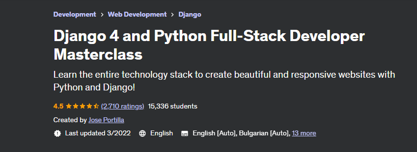

# Django 4 and Python Full Stack Developer Masterclass
Technology stack to create websites with Python and Django

## Summary
The content within this repository is my own work produced as a result of completing the course  "Django 4 and Python Full-Stack Developer Masterclass", authored by Jose Portilla.
* https://www.udemy.com/course/django-and-python-full-stack-developer-masterclass/
  

## IDE used
Visual Studio Code with Python extension - https://code.visualstudio.com/download

### About me
* George Calin
* george.calin [at] gmail.com
* LinkedIn: https://www.linkedin.com/in/cgeorge1978/
